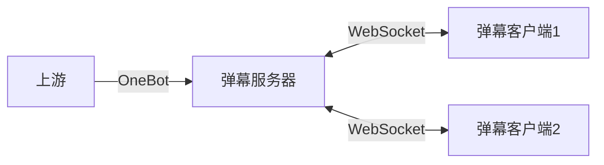

# 元火弹幕服务

## 简介

本项目旨在为现有的弹幕客户端提供统一、可靠的数据源，提升其在各种环境中的可用性与稳定性。

## 架构



## 部署

建议使用 Docker 进行部署。

项目根目录下的 [`docker-compose.yml`](./docker-compose.yml) 文件包含了弹幕服务及 NapCat 上游的配置。

在启动前，运行 `setup.sh` 脚本以创建配置文件：

```bash
./setup.sh <NapCat 账号>
```

`setup.sh` 脚本将创建 `.env` 文件，其中包含了弹幕服务的配置。接下来根据需要修改 `.env` 中的配置：

```env
ACCOUNT=<NapCat 账号>
RUST_LOG=info
DANMAKU_LISTEN=0.0.0.0
DANMAKU_PORT=5098
DANMAKU_RATE_LIMIT=25
DANMAKU_DEDUP_WINDOW=-1
```

完成配置后，通过以下命令启动服务：

```bash
docker compose up
```

首次启动时，需在命令行扫码登录。登录成功后，可退出并使用以下命令后台启动服务：

```bash
docker compose up -d
```

## 连接到弹幕服务

### 内置弹幕客户端

弹幕服务内置网页弹幕客户端，可用于 OBS 等直播软件的弹幕显示。服务启动后，可通过浏览器访问弹幕服务的 `5098` 端口查看弹幕：

```text
http://<danmaku-server>:5098/<group>
```

其中 `<danmaku-server>` 为弹幕服务的 IP 地址，`<group>` 为监听的弹幕群组（在 OneBot 上游中，对应群号）。访问成功后，页面会显示该群组下的弹幕消息。

可以通过 URL 参数指定客户端的配置项：

| 参数 | 默认值 | 描述 |
| --- | --- | --- |
| `defaultColor` | `white` | 弹幕文本颜色默认值，支持 CSS 颜色值 |
| `deafultSize` | `40` | 弹幕文本大小默认值，单位为像素 |
| `speed` | `144` | 弹幕滚动速度，单位为像素/秒 |
| `font` | `sans-serif` | 弹幕文本字体 |

例如，以下 URL 将打开一个白色、大小为 40px 的弹幕客户端：

```text
http://<danmaku-server>:5098/<group>?defaultColor=white&defaultSize=40
```

### 自定义弹幕客户端

服务启动后，WebSocket 服务将在本地 `5098` 端口（可通过环境变量自定义）监听客户端连接。客户端可以通过以下 WebSocket 地址连接至弹幕服务：

```text
ws://<danmaku-server>:5098/danmaku/<group>
```

其中 `<danmaku-server>` 为弹幕服务的 IP 地址，`<group>` 为监听的弹幕群组（在 OneBot 上游中，对应群号）。

连接成功后，弹幕服务会将接收到的弹幕以 JSON 格式的 WebSocket 文本消息发送至客户端。消息结构如下：

```typescript
type Danmaku = {
    text: string;
    color?: string;
    size?: number;
    sender?: string;
}
```

客户端也可以向服务端发送相同格式的弹幕消息，服务端会将其广播至同一群组下的所有客户端（包括发送该消息的客户端）。

### OneBot 上游

弹幕服务通过 OneBot 11 反向 WebSocket 协议与上游连接，接收消息。连接地址与弹幕服务在同一端口下，为：

```text
ws://<danmaku-server>:5098/onebot
```

## 配置

弹幕服务通过环境变量进行配置。以下是可用的配置项及默认值：

| 环境变量 | 默认值 | 描述 |
| --- | --- | --- |
| `ACCOUNT` | 无 | NapCat 账号 |
| `RUST_LOG` | 无 | 日志级别 |
| `DANMAKU_LISTEN` | 0.0.0.0 | 弹幕服务监听地址 |
| `DANMAKU_PORT` | 5098 | 弹幕服务监听端口 |
| `DANMAKU_RATE_LIMIT` | 25 | 弹幕发送速率限制（每秒） |
| `DANMAKU_DEDUP_WINDOW` | -1 | 弹幕去重窗口大小（秒），-1 表示不去重 |

## 安全性

弹幕服务本身不提供内置的身份验证功能。建议在公开网络环境下通过反向代理等手段为其添加身份验证，以防止未经授权的访问。

为防止恶意请求，服务对客户端的弹幕发送速率设有限制，默认最多 25 条/秒。超过该限制的连接将被自动关闭。

## 开源许可

本项目使用 Apache-2.0 许可证开源。
