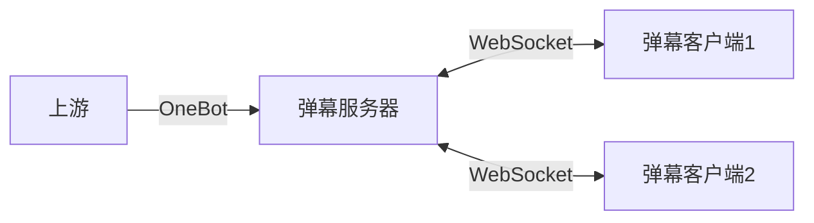

# 元火弹幕服务

## 简介

本项目旨在为现有的弹幕客户端提供统一、可靠的数据源，提升其在各种环境中的可用性与稳定性。

## 架构



## 部署

建议使用 Docker 进行部署。

项目根目录下的 [`docker-compose.yml`](./docker-compose.yml) 文件包含了弹幕服务及 NapCat 上游的配置。在启动前，请先创建 `.env` 环境变量文件，可通过复制模板 `.env.template` 文件进行初始化：

```bash
cp .env.template .env
```

根据需要修改 `.env` 中的配置，填写 NapCat 登录账号信息：

```env
ACCOUNT=<NapCat 账号>
RUST_LOG=info
DANMAKU_LISTEN=0.0.0.0
DANMAKU_PORT=5098
```

完成配置后，通过以下命令启动服务：

```bash
docker compose up
```

首次启动时，需在命令行扫码登录。登录成功后，可退出并使用以下命令后台启动服务：

```bash
docker compose up -d
```

## 连接到弹幕服务

### 弹幕客户端

服务启动后，WebSocket 服务将在本地 `5098` 端口（可通过环境变量自定义）监听客户端连接。客户端可以通过以下 WebSocket 地址连接至弹幕服务：

```
ws://<danmaku-server>:5098/danmaku/<group>
```

其中 `<danmaku-server>` 为弹幕服务的 IP 地址，`<group>` 为监听的弹幕群组（在 OneBot 上游中，对应群号）。

连接成功后，弹幕服务会将接收到的弹幕以 JSON 格式的 WebSocket 文本消息发送至客户端。消息结构如下：

```typescript
type Danmaku = {
    text: string;
    color?: string;
    size?: number;
    sender?: string;
}
```

客户端也可以向服务端发送相同格式的弹幕消息，服务端会将其广播至同一群组下的所有客户端（包括发送该消息的客户端）。

### OneBot 上游

弹幕服务通过 OneBot 11 反向 WebSocket 协议与上游连接，接收消息。连接地址与弹幕服务在同一端口下，为：

```
ws://<danmaku-server>:5098/onebot
```

## 安全性

弹幕服务不包含内置身份验证机制。在公开网络环境中部署时，建议通过反向代理等方式添加身份验证，防止未经授权的访问。

## 开源许可

本项目使用 Apache-2.0 许可证开源。
