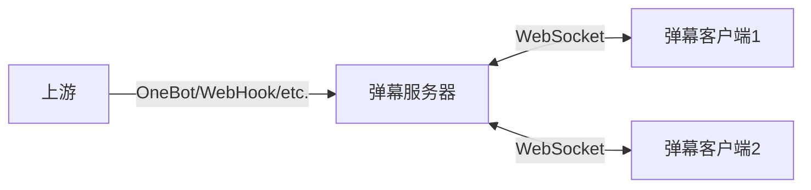

# 元火弹幕服务

## 简介

本项目旨在为现有的弹幕客户端提供统一、可靠的数据源，提升其在各种环境中的可用性与稳定性。

## 架构



## 连接到弹幕服务

### 网页弹幕显示

弹幕服务内置网页弹幕客户端，可用于 OBS 等直播软件的弹幕显示。服务启动后，可通过浏览器访问弹幕服务的 `5098` 端口查看弹幕：

```text
http://<danmaku-server>:5098/<group>
```

其中 `<danmaku-server>` 为弹幕服务的 IP 地址，`<group>` 为监听的弹幕群组的标识符（可能为群号、群名或频道ID等，依上游而定）。访问成功后，页面会显示该群组下的弹幕消息。

可以通过 URL 参数指定客户端的配置项：

| 参数 | 默认值 | 描述 |
| --- | --- | --- |
| `defaultColor` | `white` | 弹幕文本颜色默认值，支持 CSS 颜色值 |
| `deafultSize` | `40` | 弹幕文本大小默认值，单位为像素 |
| `speed` | `144` | 弹幕滚动速度，单位为像素/秒 |
| `font` | `sans-serif` | 弹幕文本字体 |

例如，以下 URL 将打开一个白色、大小为 40px 的弹幕客户端：

```text
http://<danmaku-server>:5098/<group>?defaultColor=white&defaultSize=40
```

### 网页弹幕调试

在以下地址可以打开相应群组的弹幕调试页面。该页面以列表形式显示该群组下的弹幕消息，并提供发送弹幕的功能。

```text
http://<danmaku-server>:5098/client/<group>
```

### 弹幕客户端

服务启动后，WebSocket 服务将在本地 `5098` 端口（可通过环境变量自定义）监听客户端连接。客户端可以通过以下 WebSocket 地址连接至弹幕服务：

```text
ws://<danmaku-server>:5098/danmaku/<group>
```

其中 `<danmaku-server>` 为弹幕服务的 IP 地址，`<group>` 为监听的弹幕群组的标识符（可能为群号、群名或频道ID等，依上游而定）。

连接成功后，弹幕服务会将接收到的弹幕以 JSON 格式的 WebSocket 文本消息发送至客户端。消息结构如下：

```typescript
type Danmaku = {
    text: string;
    color?: string;
    size?: number;
    sender?: string;
}
```

### OneBot 上游

弹幕服务通过 OneBot 11 反向 WebSocket 协议与上游连接，接收消息。为确保安全性，OneBot 上游与弹幕客户端使用不同的端口，默认为 `5099`：

```text
ws://<danmaku-server>:5099/onebot
```

OneBot 上游会监听群消息，并将其转发至弹幕服务。群组标识符为群号。例如，群号为 123456 的群组中的消息将转发到 `ws://<danmaku-server>:5098/danmaku/123456`。

### WebHook 上游

> WebHook 上游尚未实现完成。

WebHook 上游用于对接腾讯官方 bot API。在官方 bot 控制面板中配置 WebHook 地址为：

```text
https://<danmaku-server>/webhook
```

并相应修改 `DANMAKU_BOT_SECRET` 环境变量为 WebHook 密钥。

需要注意，官方 bot 要求弹幕服务部署必须配置 IP 白名单，并且使用 HTTPS 协议，这要求弹幕服务必须部署在有固定 IP 的公网服务器上。

由于官方 API 限制，WebHook 上游只能接收频道消息。收到的频道消息将以频道 ID 作为群组标识符，转发至弹幕服务。

### 其他上游

其他上游可以通过以下地址连接至弹幕服务。为确保安全性，上游与弹幕客户端使用不同的端口，默认为 `5099`：

```text
ws://<danmaku-server>:5099/danmaku
```

弹幕上游可以将弹幕以 JSON 格式的 WebSocket 文本消息发送至服务端。消息结构如下：

```typescript
type DanmakuPacket = {
  group: string;
  danmaku: {
    text: string;
    color?: string;
    size?: number;
    sender?: string;
  };
}
```

## 功能

### 弹幕去重

弹幕服务内置了弹幕去重功能。默认情况下，服务会在接收到的弹幕中去除重复的消息。去重窗口大小可以通过环境变量 `DANMAKU_DEDUP_WINDOW` 进行配置，单位为秒。

例如，当去重窗口大小设置为 `5` 秒时，5 秒内发送的相同弹幕消息将被视为重复消息，只有第一个消息会被转发至客户端。

如果去重窗口大小设置为 `-1`，表示不进行去重。

### 屏蔽词

弹幕服务内置了正则表达式屏蔽词功能。默认的屏蔽词列表见 [`blacklist.txt`](./assets/blacklist.txt)。

## 配置

弹幕服务通过环境变量进行配置。以下是可用的配置项及默认值：

| 环境变量 | 默认值 | 描述 |
| --- | --- | --- |
| `RUST_LOG` | 无 | 日志级别 |
| `DANMAKU_LISTEN` | 0.0.0.0 | 弹幕服务监听地址 |
| `DANMAKU_PORT` | 5098 | 弹幕服务监听端口 |
| `DANMAKU_PRIVATE_PORT` | 6099 | 弹幕上游服务监听端口 |
| `DANMAKU_DEDUP_WINDOW` | -1 | 弹幕去重窗口大小（秒），-1 表示不去重 |
| `DANMAKU_BOT_SECRET` | 无 | WebHook 上游的密钥 |

## 安全性

为保证安全性，弹幕服务会在两个不同的端口开启服务，其中一个仅有接收弹幕的功能，用于部署到公网中；另一个可以发送弹幕，用于连接在同一内网中的上游。这两个端口分别由 `DANMAKU_PORT` 和 `DANMAKU_PRIVATE_PORT` 环境变量进行配置。

弹幕服务本身不提供内置的身份验证功能。如有需要，可以通过反向代理等手段为其添加身份验证，以防止未经授权的访问。

## 部署案例

### Docker + NapCat

> NapCat 等非官方客户端可能导致 QQ 账号被封禁，使用时请谨慎。

使用 docker compose 部署弹幕服务和 NapCat 客户端，并以 OneBot 协议进行连接。

**Step 1**: 克隆本仓库，创建 `docker-compose.yml` 文件：

```yml
name: danmaku-server
services:
  napcat:
    image: mlikiowa/napcat-docker:latest
    container_name: danmaku-napcat
    environment:
      - NAPCAT_UID=1000
      - NAPCAT_GID=1000
    volumes:
      - ./napcat/config:/app/napcat/config
      - ./napcat/data:/app/.config/QQ
      - ./napcat/logs:/app/napcat/logs
    restart: always
    mem_limit: 200m
    depends_on:
      - danmaku-server

  danmaku-server:
    build:
      context: .
      dockerfile: Dockerfile
    container_name: danmaku-server
    env_file:
      - .env
    ports:
      - 5098:5098
    restart: always
```

**Step 2**: 写入 NapCat 配置文件。将以下内容保存到 `napcat/config/onebot11_<ACCOUNT>.json`，其中 `<ACCOUNT>` 为 QQ 账号：

```json
{
    "network": {
        "websocketClients": [],
        "websocketServers": [
            {
                "name": "danmaku",
                "enable": true,
                "url": "ws://danmaku-server:5099/onebot",
                "messagePostFormat": "array",
                "reportSelfMessage": false,
                "reconnectInterval": 5000,
                "token": "",
                "debug": false,
                "heartInterval": 30000
            }
        ],
        "httpClients": [],
        "httpServers": []
    },
    "musicSignUrl": "",
    "enableLocalFile2Url": false,
    "parseMultMsg": true
}
```

**Step 3**: 将 `.env.template` 文件拷贝为 `.env`，并根据需要修改环境变量。

**Step 4**: 完成配置后，通过以下命令启动服务：

```bash
docker compose up
```

首次启动时，需在命令行扫码登录。

**Step 5**: 登录成功后，可退出并使用以下命令后台启动服务：

```bash
docker compose up -d
```

## 开源许可

本项目使用 Apache-2.0 许可证开源。
